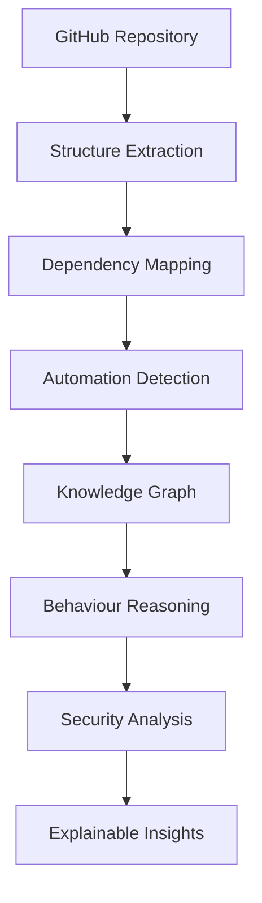
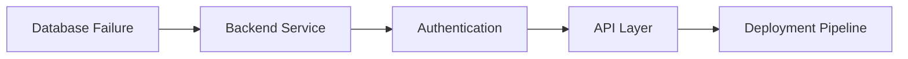
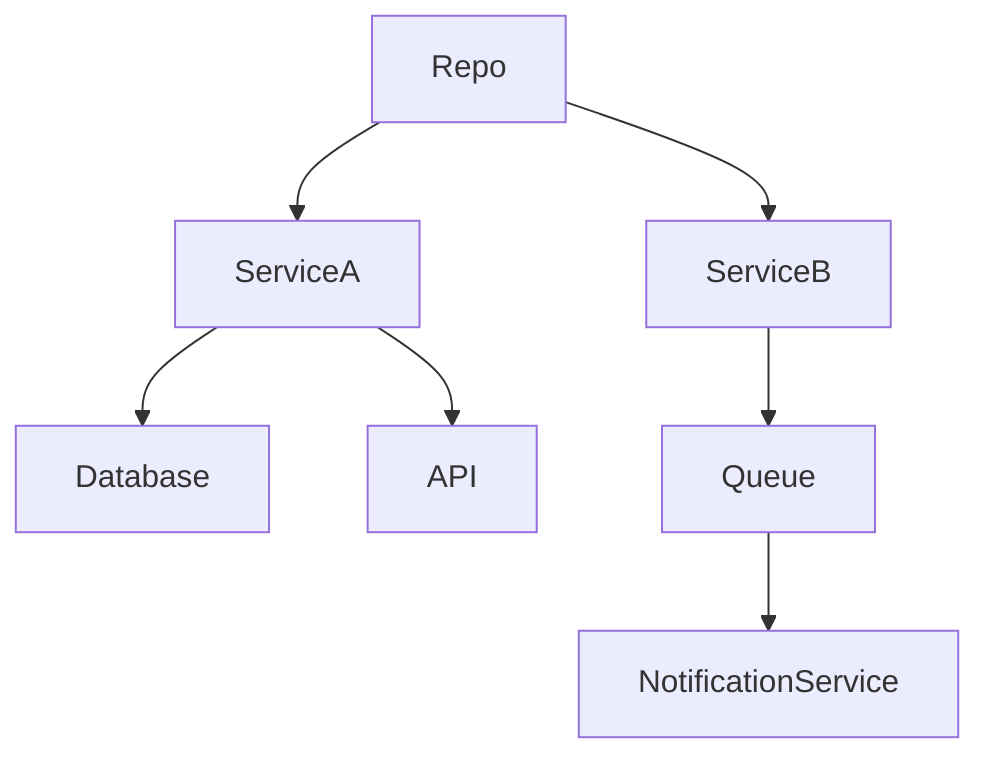

# Cognisys

### AI System Behaviour & Automation Intelligence Engine

> Understand software systems the way an engineer would — by reasoning about structure, automation, dependencies, and behavioural risks.

---

## 🚀 Why Cognisys?

Modern software systems are no longer just codebases.

They contain:

* CI/CD pipelines
* Automated workflows
* Infrastructure definitions
* Event-driven services
* Security-sensitive integrations

As systems grow, developers lose visibility into:

* How components interact
* Which workflows trigger automatically
* Where failures propagate
* Which automation paths create security risks

**Cognisys acts as an AI-powered software reasoning engine that reconstructs system behaviour directly from a repository.**

---

## 🎯 What Cognisys Does

### Repository Understanding

Automatically identifies:

* Services
* Modules
* APIs
* Databases
* Infrastructure Components

### Workflow Intelligence

Detects:

* GitHub Actions
* CI/CD Pipelines
* Event Triggers
* Deployment Flows

### Behaviour Reasoning

Answers questions like:

> What happens if this service fails?

> Which workflows are affected?

> Which automation chain breaks?

> How does a deployment propagate through the system?

### Security Intelligence

Identifies:

* Privilege escalation paths
* Over-permissioned workflows
* Unsafe automation chains
* Sensitive dependency relationships

---

# 🏗 System Architecture

```text
                    ┌──────────────────┐
                    │ GitHub Repository │
                    └─────────┬────────┘
                              │
                              ▼
                 ┌────────────────────────┐
                 │ Structure Extraction   │
                 └─────────┬──────────────┘
                           │
                           ▼
                 ┌────────────────────────┐
                 │ Interaction Modeling   │
                 └─────────┬──────────────┘
                           │
                           ▼
                 ┌────────────────────────┐
                 │ Automation Detection   │
                 └─────────┬──────────────┘
                           │
                           ▼
                 ┌────────────────────────┐
                 │ Behaviour Reasoning    │
                 └─────────┬──────────────┘
                           │
                           ▼
                 ┌────────────────────────┐
                 │ Security Analysis      │
                 └─────────┬──────────────┘
                           │
                           ▼
                 ┌────────────────────────┐
                 │ Explainable Insights   │
                 └────────────────────────┘
```

---

# 🔄 Behaviour Reasoning Flow

```text
Repository
    │
    ▼
Parse Files
    │
    ▼
Build Dependency Graph
    │
    ▼
Detect Automation Workflows
    │
    ▼
Generate System Knowledge Graph
    │
    ▼
Counterfactual Reasoning
    │
    ▼
Risk Analysis
    │
    ▼
Human Readable Explanation
```

---

# 🧠 Core AI Capabilities

### Structural Reasoning

Understands:

* Components
* Services
* Dependencies
* Data Flow

---

### Counterfactual Reasoning

Simulates scenarios:

```text
"What if Service A goes down?"

"What if deployment fails?"

"What if a workflow is compromised?"
```

---

### Automation Intelligence

Maps:

```text
Push Event
   ↓
Build Workflow
   ↓
Test Workflow
   ↓
Deploy Workflow
   ↓
Notification Workflow
```

and reasons about cascading effects.

---

# 🔒 Security Analysis

Cognisys identifies:

| Risk                  | Description                     |
| --------------------- | ------------------------------- |
| Excessive Permissions | Over-privileged workflows       |
| Secret Exposure       | Unsafe secret handling          |
| Automation Abuse      | Dangerous workflow chains       |
| Dependency Risks      | High-impact dependency failures |
| Blast Radius          | Failure propagation analysis    |

---

# 💡 Example Insight

### Input

```text
Repository contains:
- Backend Service
- Database
- CI/CD Pipeline
- Deployment Workflow
```

### Cognisys Output

```text
Deployment Workflow depends on Build Workflow.

If Build Workflow fails:
  → Deployment is blocked.

Database outage affects:
  → Backend Service
  → Authentication Layer

Risk Level: High

Blast Radius: 3 Components
```

---

# 🛠 Tech Stack

### AI & Analysis

* Python
* LangGraph
* LangChain
* LLM Reasoning

### Graph Intelligence

* NetworkX
* Knowledge Graphs

### Backend

* FastAPI

### Visualization

* Mermaid
* Graph Rendering

---

# 🎥 Future Roadmap

### Phase 1

* Repository Understanding
* Workflow Detection
* Security Insights

### Phase 2

* Architecture Reconstruction
* Knowledge Graph Generation
* Impact Analysis

### Phase 3

* Autonomous System Auditing
* Continuous Monitoring
* Enterprise Integration

---

# 🏆 Hackathon Track

**AI for Learning & Developer Productivity**

---

# 🌟 Vision

Cognisys aims to become an AI Systems Intelligence Layer capable of understanding not only what a software system contains, but how it behaves, evolves, and fails.

---

## Diagrams to add as images in repo

### Architecture Diagram



### Risk Propagation Diagram



### Knowledge Graph Diagram



ing" focused than a typical student repo.
